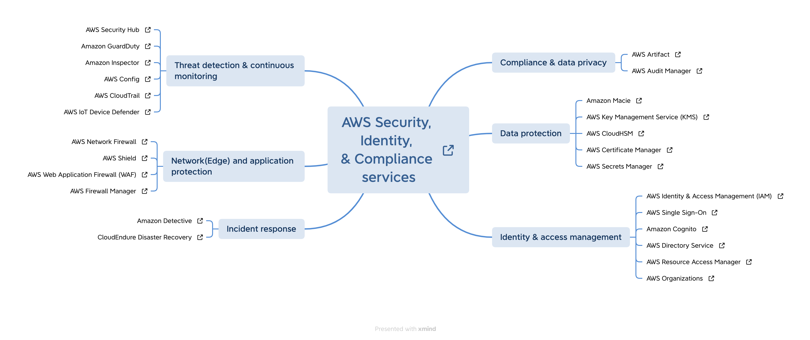
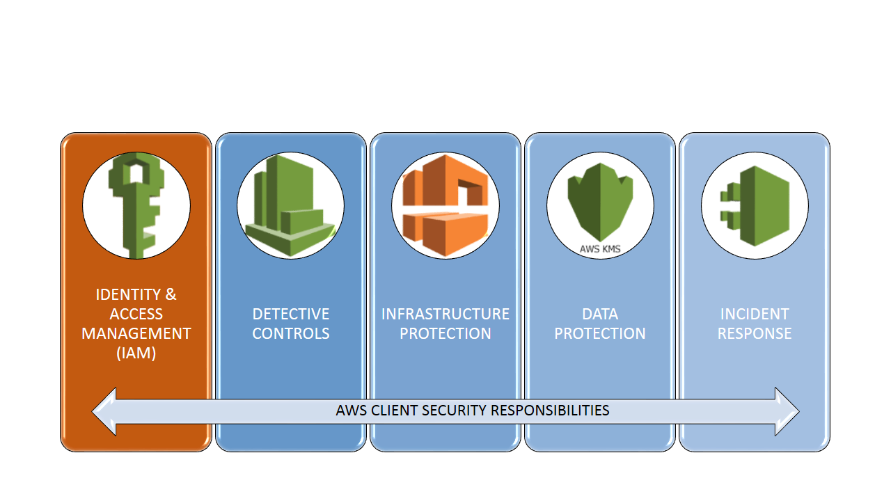

# Dominio 1: Design de arquiteturas seguras.

## Exercicios (Skill Builder)
- :blue_book: :watch: 15min AWS Identity and Access Management - Basics (Portuguese)
- :rocket: Lab :watch: 45min - Introduction to AWS Identity and Access Management (IAM)
- :blue_book: :watch: 3h  Getting Started with AWS Security, Identity, and Compliance (Portuguese)
- :rocket: Lab :watch: 2h - Role Assumption Challenge (Portuguese)

    ##### INTRODUÇÃO AO CURSO
    - Visão geral 100 Percent Complete
    - On-premises e a Nuvem AWS 100 Percent Complete
    - Segurança na nuvem AWS 100 Percent Complete
    - O AWS Well-Architected Framework 100 Percent Complete

    ##### IDENTITY AND ACCESS MANAGEMENT
    - Autenticação versus Autorização 100 Percent Complete
    - AWS IAM para gerenciamento de acesso 100 Percent Complete
    - Amazon Cognito para autenticação móvel 100 Percent Complete
    - AWS Directory Service para federação de usuários 100 Percent Complete

    ##### CONTROLES DE DETECÇÃO
    - Visão geral do monitoramento 100 Percent Complete
    - Amazon GuardDuty para detecção de ameaças 100 Percent Complete
    - AWS Security Hub para priorização de descobertas 100 Percent Complete
    - Amazon Macie para monitoramento de dados 100 Percent Complete
    - AWS WAF para filtragem de tráfego 100 Percent Complete
    - AWS Shield para proteção contra DDoS 100 Percent Complete

    ##### PROTEÇÃO DE DADOS
    - Criptografia na AWS 100 Percent Complete
    - AWS KMS para gerenciamento de chaves 100 Percent Complete
    - AWS Certificate Manager para proteger as comunicações 100 Percent Complete
    - AWS Secrets Manager para gerenciamento de credenciais 100 Percent Complete

    ##### RESPOSTA A INCIDENTES
    - Repensar a resposta a incidentesRepensar a resposta a incidentes 100 Percent Complete
    - AWS Config para responder a incidentes

#### Mapa

- [Security](./mapas/security_map.xmind)

     

#### Pilares de seguranca

     

## Resumo do conteudo

####  1. IAM - Manutenção de Acessos

A IAM do AWS permite que você gerencie com precisão as permissões de acesso dos usuários aos recursos do AWS. Com a IAM, você pode criar e gerenciar identidades de usuário e conceder ou negar permissões de acesso a recursos.

- Crie e gerencie usuários, grupos e funções.
- Defina políticas de acesso granulares para recursos específicos.
- Gerencie as credenciais de segurança dos usuários.

#### 2. IAM - Segurança e Conformidade

A IAM é uma ferramenta fundamental para a segurança e conformidade em sua organização AWS. Com a IAM, você pode:

- Aplicar o princípio de "privilégios mínimos" ao conceder acesso a recursos.
- Monitorar e auditar as ações realizadas por usuários e funções.
- Integrar com outros serviços da AWS para reforçar a segurança.

#### 3. IAM - Assumir Papéis

A funcionalidade de "Assumir Papéis" da IAM permite que você delegue temporariamente permissões de acesso a usuários, serviços ou contas da AWS. Isso é útil para cenários em que você precisa conceder acesso a recursos específicos sem fornecer credenciais permanentes.

- Crie e configure funções de confiança para assumir papéis.
- Delegue permissões para usuários e serviços assumirem esses papéis.
- Estabeleça relações de confiança entre contas da AWS.

#### 4. IAM - Web Federation

A funcionalidade de "Web Federation" da IAM permite que você integre a autenticação e autorização com serviços de identidade externos. Isso é útil para permitir que os usuários usem suas credenciais existentes para acessar recursos da AWS.

- Configure a federação da Web com provedores de identidade externos.
- Permita que os usuários façam login usando suas contas corporativas.
- Forneça acesso seguro a recursos da AWS usando identidades externas.

#### 5. IAM - Lógica de Avaliação de Política

As políticas da IAM são escritas usando uma linguagem de lógica de avaliação de políticas que define as permissões de acesso. Essa linguagem permite que você especifique condições lógicas para controlar com precisão o acesso aos recursos.

- Use elementos lógicos, como condições IF/THEN, para definir permissões.
- Especifique atributos de contexto, como endereços IP e horários de acesso.
- Defina políticas granulares para recursos específicos.

#### 6. IAM - Introdução a Organizações

O AWS Organizations é um serviço que permite consolidar várias contas da AWS em uma única organização. A IAM é usada para gerenciar acesso e permissões em uma estrutura organizacional.

- Crie e gerencie unidades organizacionais (OUs) para estruturar sua organização.
- Defina políticas de serviço e recursos em nível de organização.
- Simplifique a gestão centralizada de várias contas da AWS.

#### 7. IAM - Configurar Múltiplas Contas e Melhores Práticas com IAM Organizações

A configuração de várias

 contas com o uso do serviço IAM Organizações é uma prática recomendada para melhorar a segurança e a governança na AWS. Além disso, permite que você gerencie recursos e permissões em toda a organização.

- Crie e gerencie várias contas da AWS usando IAM Organizações.
- Defina políticas e permissões em nível de organização.
- Aplique as melhores práticas de segurança e governança em toda a organização.

#### 8. IAM - AWS Control Tower

O AWS Control Tower é um serviço que oferece recursos para configurar e governar uma estrutura segura e bem gerenciada na AWS. A IAM é usada para definir e gerenciar permissões e acesso nos recursos configurados pelo Control Tower.

- Configure e implante um ambiente seguro com as configurações padrão do Control Tower.
- Defina políticas de acesso e permissões em nível de conta usando a IAM.
- Mantenha a conformidade e aplique as melhores práticas fornecidas pelo Control Tower.

## Links 
https://aws.amazon.com/whitepapers/?whitepapers-main.sort-by=item.additionalFields.sortDate&whitepapers-main.sort-order=desc&awsf.whitepapers-content-type=*all&awsf.whitepapers-global-methodology=*all&awsf.whitepapers-tech-category=tech-category%23security-identity-compliance&awsf.whitepapers-industries=*all&awsf.whitepapers-business-category=*all
https://dzone.com/articles/the-fundamental-security-concept-in-aws-part-1
https://aws.amazon.com/blogs/security/top-10-security-items-to-improve-in-your-aws-account/
https://aws.amazon.com/cognito/
https://aws.amazon.com/directoryservice/?c=sc&sec=srv
https://aws.amazon.com/iam/
https://aws.amazon.com/iam/identity-center/
https://docs.aws.amazon.com/cognito/latest/developerguide/cognito-scenarios.html